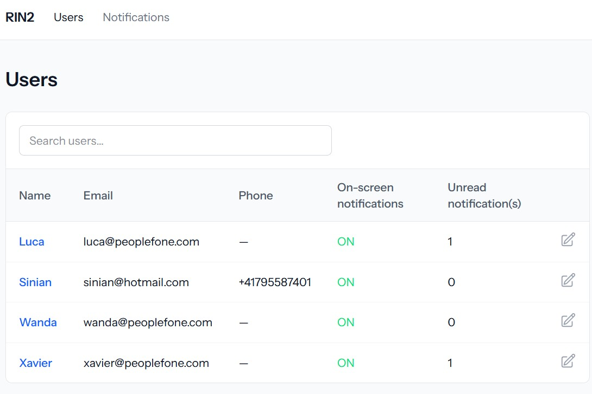
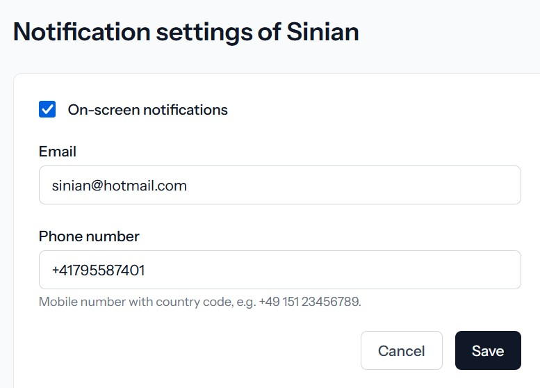
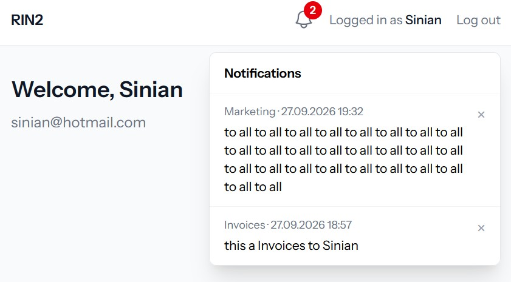
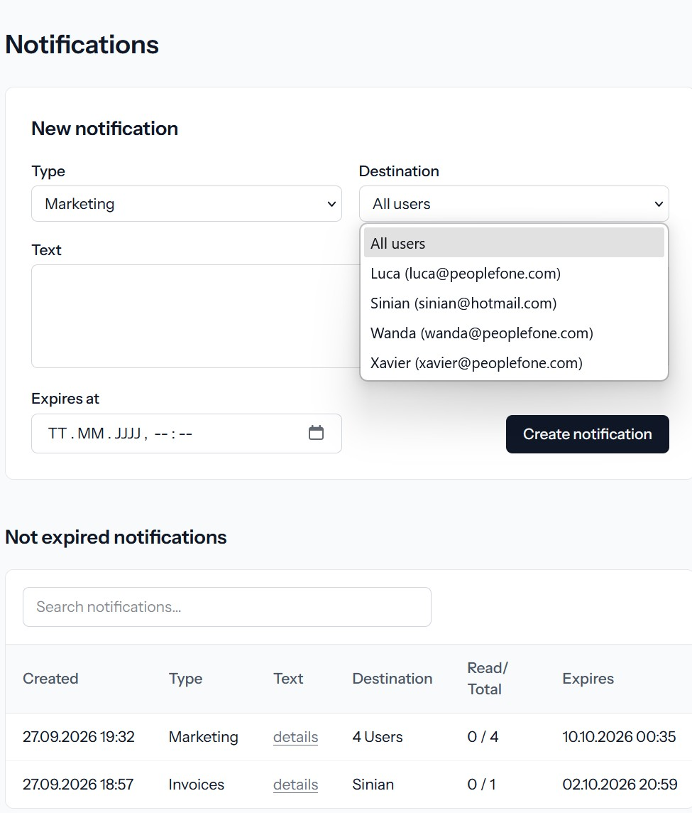

# RIN2 – Web app with one-time notifications

A proof of concept (PoC) built with Laravel and Blade. App user as admin can post notifications to one user or to
all users. Users see them as **one-time notifications** behind a bell-icon in the top bar if the user setting 'on-screen notifications' is on.


---

## Contents

1. [Features](#features)
2. [Tech stack](#tech-stack)
3. [Installation](#installation)
4. [Design decisions](#design-decisions)
5. [Project structure](#project-structure)
6. [Routes](#routes)
7. [Known limitations](#known-limitations)
8. [HTTPS localhost](#https-localhost)

---

## Features

- see orinigal requirements in [`Requirements/Web app with Notifications.pdf`](Requirements/Web%20app%20with%20Notifications.pdf)


---

## Tech stack

| Part | Used |
|---|---|
| Language / framework | PHP 8.5, Laravel 13 |
| Database | MySQL 8 |
| Frontend | Blade templates, Tailwind CSS 4, Vite, vanilla JavaScript, no laravel starter kit, no SPA framework |
| Phone validation | [`propaganistas/laravel-phone`](https://github.com/Propaganistas/Laravel-Phone), based on Google's libphonenumber (`giggsey/libphonenumber-for-php-lite`) |
| Table search | [`simple-datatables`](https://github.com/fiduswriter/simple-datatables) (full text search as filter only, no sorting, no pagination, etc.) |
| Tests | No PhpUnit-Tests implemented |


---

## Installation

### 1. Prerequisites

- PHP ≥ 8.3 with the usual Laravel extensions (`pdo_mysql`, `mbstring`, `xml`, `curl`, …)
- Composer 2
- Node.js ≥ 20 and npm
- MySQL 8

On Linux or Ubuntu, MySQL can be installed and started with:

```bash
sudo apt install mysql-server
sudo service mysql start
```

### 2. Create the database

```bash
sudo mysql
```

```sql
CREATE DATABASE IF NOT EXISTS laravel;
-- Only if the root user should log in with a password (as in this setup):
ALTER USER 'root'@'localhost' IDENTIFIED WITH mysql_native_password BY 'root';
FLUSH PRIVILEGES;
EXIT;
```

### 3. Install the project step by step

Project: https://github.com/sinianzhang/rin2

Unpack the archive (or clone the repository) and go into the project folder:

```bash
cd one-time-notification

composer install
npm install

cp .env.example .env
php artisan key:generate
```

### 4. Configure the database in `.env`

`.env.example` uses SQLite by default. Change the `DB_*` lines to MySQL:

```dotenv
DB_CONNECTION=mysql
DB_HOST=127.0.0.1
DB_PORT=3306
DB_DATABASE=laravel
DB_USERNAME=root
DB_PASSWORD=root
```

Optionally set `APP_NAME=RIN2`, which is shown in the top bar.

### 5. Migrate, seed, build, run

```bash
php artisan migrate --seed   # tables + 4 demo users (Sinian, Luca, Xavier, Wanda)
npm run build                # compile CSS/JS (or keep `npm run dev` running while developing)
php artisan serve
```

Open **http://localhost:8000/users**.


---


## Design decisions

### Users

- Admin sees all users and theire basic information, amount of active and unread notifications. 
- Admin can filter the users and edit user setting on clicking edit-icon

### User edit

- Admin can edit user information
- User sees active and unread notification (bell-icon) only if 'on-screen notifications' is ON 
- Besides HTML-validation, the telefon number is validated via Google's libphonenumber (No API key needed, free open source, with quick laravel integration)

### User home

- Admin can impersonate a user (simulated login/logout) to user home page
- If the user has 'on-screen notifications' on, he can click on bell-icon and list his own active and unread notifications in dropdown
- On clicking close-icon, the notification is to be set read and disappers

### Notifications

- Admin can create a new notification sending to all or one user and define the expiration time, etc.
- Admin gets a list of all active notifications, he can filter the notifications, see basic information like if a notification alread by one or all read and read the notifcation on clicking details-link.

---

## Project structure

Only the files written for this project are listed.

```
app/
├─ Enums/NotificationType.php                  marketing | invoices | system
├─ Http/Controllers/
│  ├─ UserController.php                       users list, edit + update settings
│  ├─ ImpersonationController.php              log in as a user / log out
│  ├─ HomeController.php                       home page with bell + unread list
│  ├─ NotificationReadController.php           mark a notification as read (×)
│  └─ NotificationPostController.php           post + list notifications
├─ Http/Requests/
│  ├─ UpdateUserRequest.php                    settings validation (incl. mobile number)
│  └─ StoreNotificationPostRequest.php         new notification validation
└─ Models/
   ├─ User.php                                 + notificationPosts() relation
   └─ NotificationPost.php                     recipients() relation, notExpired() scope
database/
├─ migrations/2026_09_27_140926_extend_users_table.php
├─ migrations/2026_09_27_143845_create_notification_posts_table.php
├─ migrations/2026_09_27_143846_create_notification_recipients_table.php
├─ factories/UserFactory.php
└─ seeders/DatabaseSeeder.php                  4 demo users
resources/
├─ views/components/layout.blade.php           shared layout + top bar
├─ views/components/bell-icon.blade.php, edit-icon.blade.php
├─ views/users/index.blade.php, edit.blade.php
├─ views/home/index.blade.php
├─ views/notifications/index.blade.php
├─ js/app.js                                   simple-datatables search
└─ css/app.css                                 Tailwind + table search styling
routes/web.php
Requirements/                                  task PDF + setup notes
```

---

## Routes

| Method | URL | Name | Purpose |
|---|---|---|---|
| GET | `/users` | `users.index` | Users list |
| GET | `/users/{user}/edit` | `users.edit` | Settings form |
| PUT | `/users/{user}` | `users.update` | Save settings |
| POST | `/impersonate/{user}` | `impersonate.store` | Log in as the user |
| DELETE | `/impersonate` | `impersonate.destroy` | Log out |
| GET | `/home` | `home` | Home page with bell (auth) |
| POST | `/home/notifications/{notificationPost}/read` | `home.notifications.read` | Mark as read (auth) |
| GET | `/notifications` | `notifications.index` | Post form + notifications list |
| POST | `/notifications` | `notifications.store` | Post a notification |

---

## Known limitations

This is a PoC, all the mentined requirements are implemented, so some things, which are not explizit required, are intentionally left out:

- **No real authentication or roles.** Anyone can open the admin pages, edit users and impersonate them.
- **"All users" is resolved at posting time.** Users created later do not receive earlier notifications.
- **Notifications are only shown on screen.** Email and phone number are stored and validated, but no
  email or SMS is sent.
- **The notifications list shows active notifications only.** Expired ones stay in the database but are not
  listed.
- **Easy Filtering by simple-datatabes** Only full text seach as filter, no pagination, no custom sorting, etc.
- **Datepicker format not localized** Default localization DE from browser, no localized date format: TT.MM.JJJJ
- **No PhpUnit-Tests are implemented** In practice, TDD (test-driven development) is the preferred approach.


## HTTPS localhost
This laravel project is running with https on my local development https://localhost:8443
- Please reed [`Notizen.txt -> HTTPS - laravel project with https on local development`](Requirements/Notizen.txt)